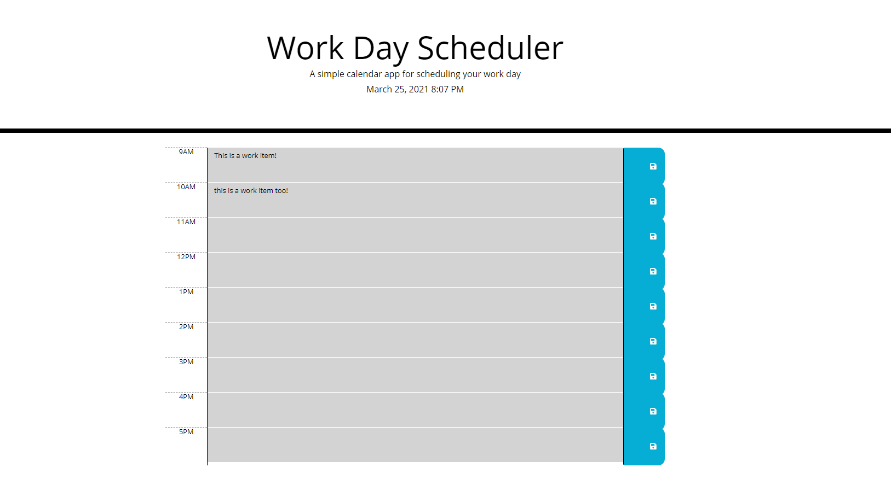

# Work Day Scheduler




## Description
This is an application that allows Users to track their schedule for a workday. The user can input text and then click the save button. This saved content is stored in the browser via localstorage so the text that was entered persists after the user navigates away from the page or refreshes the page.

## Installation
To clone this to your repository, please use 
```
SSH: git clone git@github.com:d606n6k/work-day-scheduler.git
```
```
HTTPS: git clone https://github.com/d606n6k/work-day-scheduler.git
```
```
GitHub CLI: gh repo clone d606n6k/work-day-scheduler
```

## Usage
Enter text into any of the fields and click the blue save button. If you navigate from the page, any text entered will be stored in the hour field! 


## Credits
Author: William A. Lucht

## License
- MIT License Copyright (c) [2021] [William Lucht]
- Permission is hereby granted, free of charge, to any person obtaining a copy of this software and associated documentation files (the "Software"), to deal in the Software without restriction, including without limitation the rights to use, copy, modify, merge, publish, distribute, sublicense, and/or sell copies of the Software, and to permit persons to whom the Software is furnished to do so, subject to the following conditions: The above copyright notice and this permission notice shall be included in all copies or substantial portions of the Software. THE SOFTWARE IS PROVIDED "AS IS", WITHOUT WARRANTY OF ANY KIND, EXPRESS OR IMPLIED, INCLUDING BUT NOT LIMITED TO THE WARRANTIES OF MERCHANTABILITY, FITNESS FOR A PARTICULAR PURPOSE AND NONINFRINGEMENT. IN NO EVENT SHALL THE AUTHORS OR COPYRIGHT HOLDERS BE LIABLE FOR ANY CLAIM, DAMAGES OR OTHER LIABILITY, WHETHER IN AN ACTION OF CONTRACT, TORT OR OTHERWISE, ARISING FROM, OUT OF OR IN CONNECTION WITH THE SOFTWARE OR THE USE OR OTHER DEALINGS IN THE SOFTWARE.